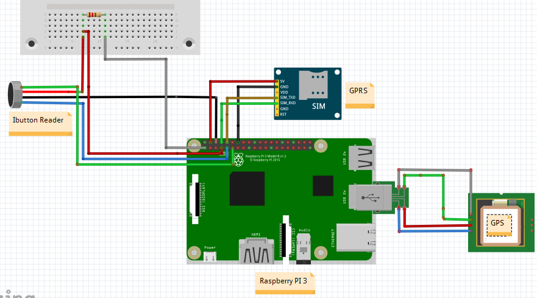

# NP PMS - NP HUB Software
Este software es el que se corre en los Hubs del sistema NP PMS.
Desarrollado por Nelson Pérez y Nathaly Persia como proyecto de grado. 2017-2018.
`Para solicitar documentacion adicional sobre algo, enviame un email a 
me@nelsonperez.net
`

La aplicación está desarrollada en Javascript con NodeJS, a excepción del manejo de bluetooth, que se
hace con la librería PyBluez de Python.

>El objetivo general del NP PMS es Desarrollar un sistema de 
rastreo posicional para la Policía Nacional Dominicana que permita el
efectivo despliegue de unidades de patrullaje, administrado 
desde los destacamentos. 

>PMS Hub: Artefacto que se coloca en el vehículo policíaco y permite la obtención
 de información geo posicional, autenticación de policías  y conexión a Internet mediante un modulo GPRS.
 
###### Recomendaciones previas
- Es indispensable que conozcas lo que son [Callbacks](https://codeburst.io/javascript-what-the-heck-is-a-callback-aba4da2deced?gi=c209d2e9c41b),
[Promises](https://developer.mozilla.org/en-US/docs/Web/JavaScript/Reference/Global_Objects/Promise) y 
[Async/Await](https://hackernoon.com/6-reasons-why-javascripts-async-await-blows-promises-away-tutorial-c7ec10518dd9)
en Javascript para entender el flujo de la aplicación, ya que la mayoría de las operaciones son asíncronas y pueden 
llegar a ser confusas.
- [Getting started with Node](https://codeburst.io/getting-started-with-node-js-a-beginners-guide-b03e25bca71b)
- [Los módulos en NodeJS](https://www.w3schools.com/nodejs/nodejs_modules.asp) tambien son importantes.
- [Eventos en Nodejs](https://www.w3schools.com/nodejs/nodejs_events.asp) y el EventEmitter class.

###### Notas sobre archivos no utilizados
Existen unos archivos en `app/modules`, `app/core` y `lib` relacionados a una pantalla LCD 20x4 que inicialmente 
era parte del proyecto. En esta versión la pantalla LCD no se esta utilizando, por lo que cualquier bloque de codigo
que haga referencia a la LCD puede ser ignorado, a menos que quieras utilizarla. En ese caso, escríbenos y agregaremos
la LCD y el directorio `modules` a este readme.

**Tanto el código como la documentación estan en Spanglish. Si no sabes inglés, lo sentimos.**

## Componentes físicos
* [Raspberry Pi 3 Model B V1.2 2015](https://www.raspberrypi.org/products/raspberry-pi-3-model-b/)
* [Módulo GPRS SIMCOM 800c Shield](http://simcomm2m.com/En/module/detail.aspx?id=74)
* [Módulo GPS U-blox 6M](https://www.u-blox.com/en/product/neo-6-series)
* [Ibutton Reader DS9092](https://www.ebay.com/sch/i.html?_odkw=ibutton+reader&_osacat=0&_from=R40&_trksid=p2045573.m570.l1313.TR0.TRC0.H0.XDS+9092+ibutton+reader.TRS1&_nkw=DS+9092+ibutton+reader&_sacat=0)



## Configuración en la Pi
*Este documento asume que tienes conocimientos básicos de Linux*

En esta sección se explica como hacer el setup inicial con la Pi para correr el proyecto.
##### Notas
* Recomendamos que la Pi corra [Raspbian Stretch Lite March 2018](https://www.raspberrypi.org/downloads/raspbian/).
* Esta versión de Raspbian no tiene interface desktop, lo que la hace muy rápida. [Este articulo](https://hackernoon.com/raspberry-pi-headless-install-462ccabd75d0) indica como conectarse a la Pi luego de descargar raspbian. 
* Es recomendable configurar una IP estática para no tener que encontrar la IP asignada a la pi
cada vez que bootea y se conecta a la red. Para ello, se puede seguir la sección **dhcpcd method**
 de [este tutorial](https://raspberrypi.stackexchange.com/questions/37920/how-do-i-set-up-networking-wifi-static-ip-address/74428#74428)

##### Bluetooth en Raspbian Stretch
El NP Hub utiliza el bluetooth de la Pi para comunicarse con el smartphone.
Para poder utilizar el bluetooth de la manera que queremos, es necesario seguir 
las instrucciones siguientes. (Comandos a correr en la Pi)

Conéctate a la Pi por SSH. Si no has cambiado el default password, es 'raspberry'
```bash
ssh pi@[IP DE LA PI]
```

Actualizar el software de la Pi.
```bash
sudo apt-get update && sudo apt-get upgrade
```

Arreglar un problema del bluetooth con Raspbian Stretch.
```text
sudo sed -i 's|^ExecStart=/usr/lib/bluetooth/bluetoothd$|ExecStart=/usr/lib/bluetooth/bluetoothd --noplugin=sap|' /lib/systemd/system/bluetooth.service
sudo service bluetooth restart
sudo systemctl daemon-reload
```

Agregar usuario pi al grupo bluetooth.
```bash
sudo adduser pi bluetooth
sudo reboot
```

Instalar librerías necesarias.
```bash
sudo apt-get install libbluetooth-dev python-dev python-pip ipython -y
sudo pip install PyBluez
sudo pip install pexpect
```

En este punto el bluetooth debería estar funcionando correctamente.
Compruebalo haciendo :
```bash
pi@raspberrypi:~ $ bluetoothctl
[NEW] Controller B8:27:EB:02:33:C2 raspberrypi [default] <--- Todo bien.
[bluetooth]# 
```
##### Ibuttons y protocolo 1Wire con la pi

Agregar lo siguiente antes de *exit 0* en el archivo `/etc/rc.local` (editar con sudo)
```text
sudo chmod a+w /sys/devices/w1_bus_master1/w1_master_slaves
sudo chmod a+w /sys/devices/w1_bus_master1/w1_master_remove
sudo chmod a+w /sys/devices/w1_bus_master1/w1_master_search
```
Esto se asegurará de que los permisos para trabajar con el protocolo 1Wire sean establecidos 
cuando la Pi bootee.

Es necesario editar el siguiente archivo para hacer que las lecturas con 1Wire sean más rápidas:
```bash
sudo nano /etc/modprobe.d/w1.conf
```
Y agregar:
```text
options wire timeout=1 slave_ttl=1
```

##### Instalando NodeJs y NPM
```bash
curl -sL https://deb.nodesource.com/setup_9.x | sudo -E bash -
sudo apt-get install -y nodejs
```

##### Instalar Yarn
Yarn hace la instalación de dependencias (librerías requeridas para que el proyecto funcione) más rápida que NPM.
Si te interesa leer sobre porque usar Yarn en ves de NPM, checa [esto.](https://www.keycdn.com/blog/npm-vs-yarn/)

```bash
curl -sS https://dl.yarnpkg.com/debian/pubkey.gpg | sudo apt-key add -
echo "deb https://dl.yarnpkg.com/debian/ stable main" | sudo tee /etc/apt/sources.list.d/yarn.list
sudo apt-get update && sudo apt-get install yarn -y
```

O sigue [las instrucciones oficiales de Yarn para Debian.](https://yarnpkg.com/lang/en/docs/install/#linux)

##### Git (Opcional)
Supongo que vas a instalar el proyecto haciendo un pull desde Git. Para eso, necesitas git en la Pi.
```bash
sudo apt-get install git -y
```
##### Lsyncd (Opcional)
*El siguiente paso es totalmente opcional, pero muy recomendado y te ahorrará mucho tiempo luego.*

Yo recomendaría utilizar algún método para copiar automáticamente los cambios hechos en el proyecto
desde tu PC hacia la Pi. Esto hace el proceso muy rápido porque toda la programación puede ser 
realizada desde tu PC y al guardar el proyecto localmente, automáticamente se copia a la Pi.

En nuestro caso, utilizamos [lsyncd](https://www.digitalocean.com/community/tutorials/how-to-mirror-local-and-remote-directories-on-a-vps-with-lsyncd).
Y adjunto dejo una configuración de ejemplo para copiar los cambios hechos al proyecto
desde la pc hasta la Pi, por SSH.

 _Modificar IPs y rutas a la siguiente configucación_
```text
-- /etc/lsyncd/lsyncd.conf.lua

settings{
        logfile = "/var/log/lsyncd/lsyncd.log",
        statusFile = "/var/log/lsyncd/lsyncd.status",
        statusIntervall = 1,
}

sync{
        default.rsyncssh,
        source = "/home/nel/nphub",
        targetdir = "/home/pi/nphub",
        host = "pi@192.168.1.153",
        delay           = 1,
        exclude = {"node_modules",".idea",".git"},
        rsync={rsh="/usr/bin/ssh  -o StrictHostKeyChecking=no"}
}
```

Para que esta configuración funcione, es necesario copiar el SSH Key del usuario Root de tu máquina
a la Pi. Al hacer esto, no es necesario introducir passwords al conectarse por SSH con la Pi.
Si no entiendes estos conceptos, [mira este artículo.](https://www.raspberrypi.org/documentation/remote-access/ssh/passwordless.md).

**En este punto la pi debería estar lista para correr el proyecto.** 

## Ya instalé todo, ¿y ahora?
* Primero, luego de tener los archivos del proyecto en la Pi, tenemos que instalar las dependencias del proyecto. Ubícate en el directorio del proyecto y corre `yarn`.
* Cuando las dependencias terminen de ser instaladas, el proyecto se corre desde al archivo `app.js`, haciendo
`node app.js`.
* Puedes correrlo con cualquiera de los siguientes parámetros adicionales: (Por ej: `node app.js --noAuth`)
    * `--noLocations`: No enviar localizaciones GPS.
    * `--verbose`: Que aparezca cuando se corre cada Task en la consola.
    * `--hideGprs`: Ocultar output del GPRS en consola.
    
###### ¿Qué es lo que sucede cuando el programa corre?
Se ejecutan las siguientes operaciones.

1. Se inicializan los módulos GPRS y Bluetooth.
2. El GPRS hace una solicitud inicial a `nppms.us/status` para confirmar dos cosas
    * El módulo GPRS está funcionando.
    * El módulo GPRS realmente tiene conexión a Internet.
3. Se descargan las configuraciones para este hub desde el servidor.
El servidor sabe que configuraciones entregar porque cada Hub registrado se asocia a un
serial de la Pi.
4. El Bluetooth se pone disponible para recibir conexiones de la App móvil y se envían las localizaciones 
obtenidas por el GPS, si hay alguna disponible para enviar.
    
En este punto, la app podrá conectarse al Hub. Luego de conectarse, periódicamente se hacen solicitudes al servidor
para traer incidentes, configuraciones nuevas, o nuevos mensajes.

Si necesitas mas detalles del "orden" en el que corre el código,
inicia desde `app.js`, el punto de entrada a la aplicación, a leer los comentarios del código.
Cada sección indica cuando corre. 

## Diseño del software
El código está separado según su funcionalidad y el tipo de operación que realiza cuando la aplicación está corriendo.
La ideas principales son las siguientes:

###### Services
El lugar donde se agrupan funciones que sirven para un propósito específico, como por ejemplo,
enviar un mensaje o leer del iButton reader, es llamado **Servicio** o **Service**.
Un Service puede ser llamado de cualquier parte en la aplicación, y su propósito principal es 
**agrupar funcionalidad**.

Los servicios residen en el directorio `app/services` y encima de cada uno de los servicios actuales 
se documenta para que sirve.

###### Tasks
Hay tareas que tienen que realizarse continuamente (como la recolección de localizaciones GPS). 
Estos tipos de *background processes* son llamados **Tasks** en el contexto de esta aplicación.

Entre las cosas que puede hacer un **Task** están:

 + Decidir cada cuanto tiempo desea ser corrida por el motor de la aplicación luego de la última
  vez que se corrió la tarea.
 + Utilizar cuantos Servicios sean necesarios.
 + Disparar eventos que sean escuchados de manera asíncrona en otra sección de la aplicación.
 + Almacenar data que persiste en cada iteración del task.
  
Cada **Task** necesariamente tiene que contar con una función `run` que retorne una [Promesa o Promise](https://developer.mozilla.org/en-US/docs/Web/JavaScript/Reference/Global_Objects/Promise).
Esta función será la que el motor de la aplicación llamará periódicamente para correr la tarea.

Tambien puede contener una función `initialize` si necesita inicializar algo antes de que
el motor comience a correr la tarea (ejecutando `run`) de manera periódica. 
 
Tomando el ejemplo de recolectar localizaciones GPS, es necesario recalcar que el task
no sabe _como_ obtener localizaciones GPS; esta responsabilidad es delegada a un Servicio.
Sin embargo, la tarea sí sabe _cuando_ utilizar el servicio y que hacer con el resultado que devuelva. 
 
Los Tasks o Tareas residen en el directorio `app/tasks` y encima de cada uno de las tareas actuales 
se documenta para que sirve cada una.
 
###### Props
Tanto las Tasks como los Services, y otras secciones de la aplicación, deben tener acceso a las configuraciones 
globales que determinan como la aplicación funciona. El lugar para poner variables globales que todo módulo de la aplicación pueda
importar, es en el objeto `props`, ubicado en `app/shared/props`.

###### Módulos
No confundir con módulos de nodejs. El término **Módulo** en el contexto de la aplicación está 
relacionado a la pantalla LCD (Terrible nombre, lo sabemos). Si vas a utilizar la pantalla, 
envianos un mensaje para agregar esta sección de documentación.

## Guías
##### Funcionamiento de libreria de bluetooth
Nodejs no utiliza el bluetooth de la pi directamente. Lo hace atravez de una libreria desarrollada por nosotros
en python, que utiliza pyBluez. Node levanta un nuevo thread para interactual con esta libreria y se comunica con ella
usando el STDIN y STDOUT.

Detalles sobre la libreria de bluetooth puede ser encontrada al tope del fichero `app/services/BluetoothService/main.py`

##### Crear un nuevo task
Solo hay que crear un nuevo archivo en `app/tasks`, y puedes partir de la siguiente estructura base.

```javascript
const Task  = require('./../core/Task').Task
const props = require('./../shared/props')

const ExampleTask = new Task (
    {
      name: 'ExampleTask',
      every: 1000, //Run every second after each successful 'run'
      inject: ['ExampleService'],
      ready: true
    }
);

ExampleTask.initialize = function () {
  //this.ExampleService is available here because on the 'inject' above.
  console.log("Initializing")
}

ExampleTask.run =  function () {
  return new Promise(res => {
    setTimeout(() => {
      console.log('This is an example task')
      res() //Finish task
    },5000)
  })
}

module.exports = ExampleTask;
```

##### Crear un nuevo servicio
Solo hay que crear un nuevo archivo en `app/services`. Los servicios no tienen una estructura mandatoria,
puede ser cualquier objeto que pueda ser exportado.

##### Enviar mensajes utilizando el Bluetooth
Este trabajo lo hace el BluetoothService luego de ser inicializado.
```javascript
//Desde el contexto de un task que ya halla importado BluetoothService y BtMessage.
this.BluetoothService.sendToDevice(
    {
      mac_address: "XX:XX:XX:XX",
      message: new BtMessage(
          {
            type: "TEST_MENSAJE",
            payload:  "Hola"
          }
      )
    }
)
```
Al ejecutar ese ejemplo, la aplicación móvil recibiría un JSON con
```text
{"type": "TEST_MENSAJE","payload":  "Hola"}
```
en su contenido.

##### ¿Como se hacen las solicitudes/requests a Internet?
Las solicitudes en la aplicación se realizan utilizando una cola o queue, por lo que 
es necesario agregarla a la cola y luego procesarla.

```javascript
//Agregando un request a la cola utilizando el RequestQueueService.
RequestQueueService.addRequest(
    {
        url: "http://google.com",
        method: "GET",
        priority: RequestQueueService.PRIORITY_MOST,
        event_name: "TEST_REQUEST",
        payload: {
          mensaje: "Hola",
          otraCosa: "Que tal?"
        }
    }
)
```
Luego de que la solicitud es agregada a la cola (que no es mas que una tabla en la base de datos), 
es necesario procesarla. Esto lo hace la función `processNextPendingRequest` del `RequestProcessorService`.

Si por algún motivo el requests fallo, se puede reintentar llamando el metodo `processNextFailedRequest`,
que reintenta solicitudes viejas fallidas siempre y cuando no existan solicitudes pendientes por procesar.

Cuando la aplicación esta corriendo normalmente, el `RequestProcessorTasks` se encarga de periódicamente llamar
`processNextPendingRequest` y `processNextFailedRequest` de manera que continuamente se estén procesando todas las
solicitudes a hacer al servidor.

Cada vez que una solicitud se completa, se levanta un evento con el nombre indicado en el campo `event_name` de
la cola/tabla, lo que hace que sea sencillo conocer cuando un request se completó o falló por algún motivo,
en cualquier parte de la aplicación que pueda escuchar los eventos emitidos por el `RequestProcessorService`.


